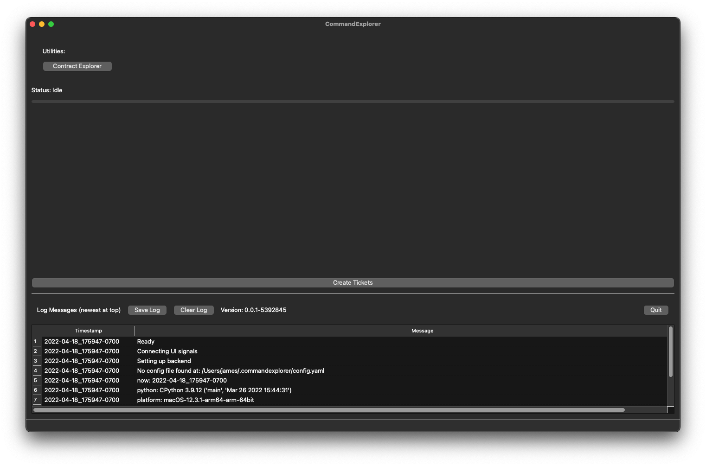
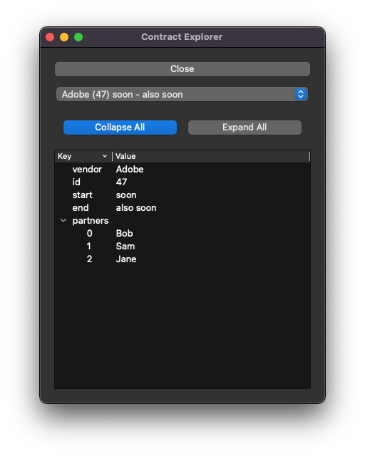

# Python3 Qt6 Base Project

This project is "CommandExplorer", a macOS application with some example functionality, 
intended as a base from which to build your own application. 

It is created using python3, [Qt6](https://doc.qt.io/qt-6/), [pyinstaller](https://pyinstaller.org/en/stable/), 
and [Qt Designer](https://build-system.fman.io/qt-designer-download)

License: [MIT](LICENSE)

## Quick Start
Build the app using `./build-app.sh`, then find it in `dist/CommandExplorer.app`

Because it is not signed, you might need to right-click, select "Open". 
The first time it won't even give you the option, so click "Cancel" and right-click, select "Open" again, 
and it will finally give you a button to open it anyway.

## Main Window

The main window includes a log at the bottom which demonstrates live logging, you can clear the log, 
or save it to your Downloads folder.

A button at the top "Contract Explorer" opens a dialog (see below).

A button at the bottom "Create Tickets", triggers a long-running action in another thread, communicating progress, 
and status back to the progress bar and status label in the UI. 
It also generates messages in the log.

Version is printed with commit_id, just above the log table.

## Dialog - Contract Explorer

This dialog lets you explore two "contracts", which are just dictionaries with example data, 
using a treeview with "expand" and "collapse" buttons.

You can have many instances of this dialog open at once, and it is resizable.

## Development
I recommend [PyCharm](https://www.jetbrains.com/pycharm/) or [Visual Studio Code](https://code.visualstudio.com) for 
editing the python, and use [Qt Designer](https://build-system.fman.io/qt-designer-download) for editing the `.ui` files. 
Do NOT edit the `.py` files (`MainWindow.py`, `DialogContractExplorer.py`) which are baked from the `.ui` 
files, they will be overwritten at next bake.

### The Files:

* `.gitignore` - what files for git to ignore, includes working folders for pyinstaller
* `bake-ui.sh` - bakes the `.ui` files into `.py` files, which are actually used by the python script
* `build-app.sh` - bake the `.ui` modules, then build the macos application (in `dist/CommandExplorer.app`)
* `test.sh` - bake the `.ui` modules, then just run it locally without building an app
* `run.sh` - bake the `.ui` modules, then build the macos application, then launch the application
* `setup-venv.sh` - creates virtualenv with contents of `requirements.txt`, used by the other scripts
* `requirements.txt` - list of python packages dependencies
* `VERSION` - where "0.0.1" is stored, indicating the version number
* `commit_id` - ignored by git, this is where we temporarily store git commit id when building the app. the commit id is appended to version in the UI
* `MainWindow.ui` - Qt Designer source file for the Main Window, gets baked into `MainWindow.py`
* `DialogContractExplorer.ui` - Qt Designer source file for the Contract Explorer dialog, gets baked into `DialogContractExplorer.py`
* `CommandExplorer.spec` - this is the config that pyinstaller uses to create the macOS app, this is where you define any extra data files that should be included. I have included the `.ui` files to be placed in a data subdirectory `ui` within the app, for convenience (they are not needed, except for development)

### Code Layout

* `CommandExplorer.py` - the entrypoint, the main script that does everything, and imports:
  * `Mod_MainWindow.py` - holds the logic for the main window, and thus the majority of the app. imports:
    * `Mod_Util.py` - basic reusable utility functions
    * `Mod_Constants.py` - place to store constants that all other files can import
    * `Mod_ThreadWorkers.py` - classes for running tasks in separate threads
    * `Mod_dictTreeModel.py` - model class for populating a treeview from a dict
    * `Mod_TableModels.py` - models for the log at the bottom (which is a tableview)
    * `MainWindow.py` - defines the main window visual layout and properties, baked from `MainWindow.ui`
    * `Mod_DialogContractExplorer.py` - holds the logic for the dialog, imports:
      * `DialogContractExplorer.py` - defines the main window visual layout and properties, baked from `DialogContractExplorer.ui`
